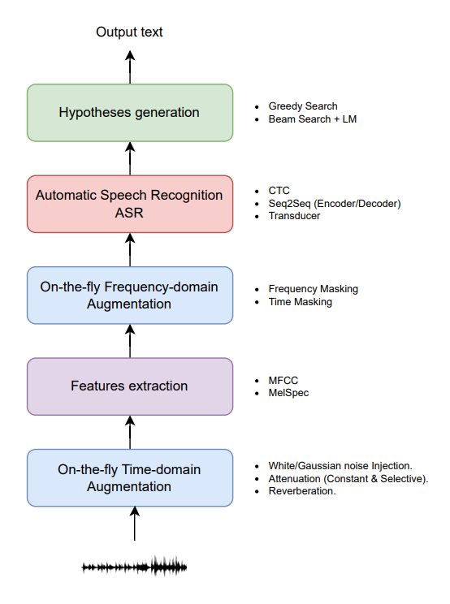

Introduction
============

SpeeQ is a Python-based framework for speech recognition, offering developers and
researchers a convenient and efficient tool to create and experiment with various
speech recognition models. By utilizing pre-existing model architectures, SpeeQ allows
users to run multiple models with minimal code, enabling rapid prototyping and testing.
Furthermore, SpeeQ includes speech data augmentation tools for both time and frequency
domains, as well as pre-defined feature extraction and training pipelines to simplify usage.
The provided image illustrates the SpeeQ speech recognition pipeline.

